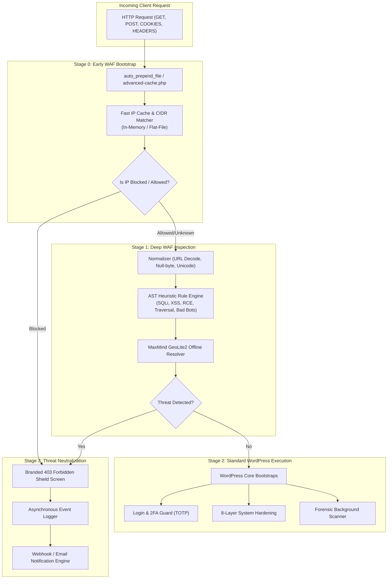
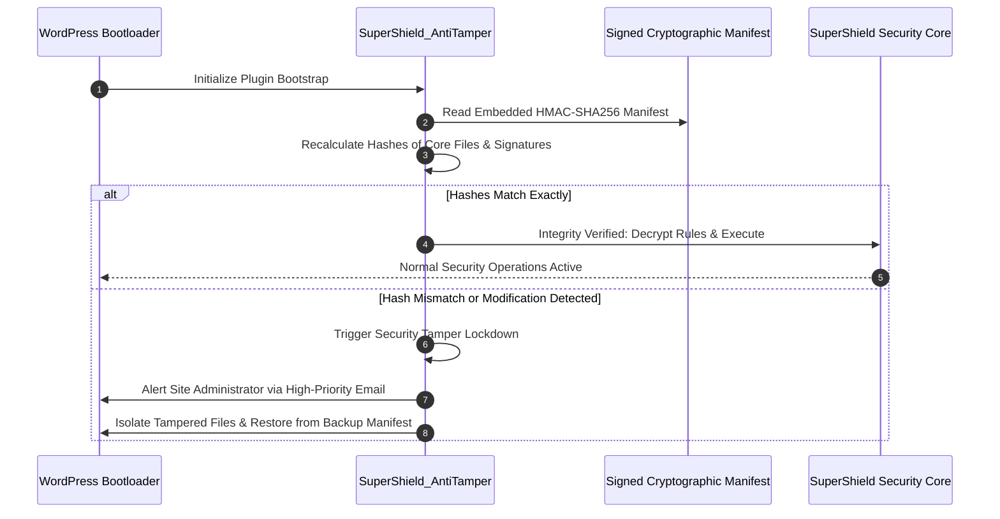
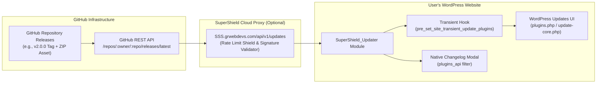
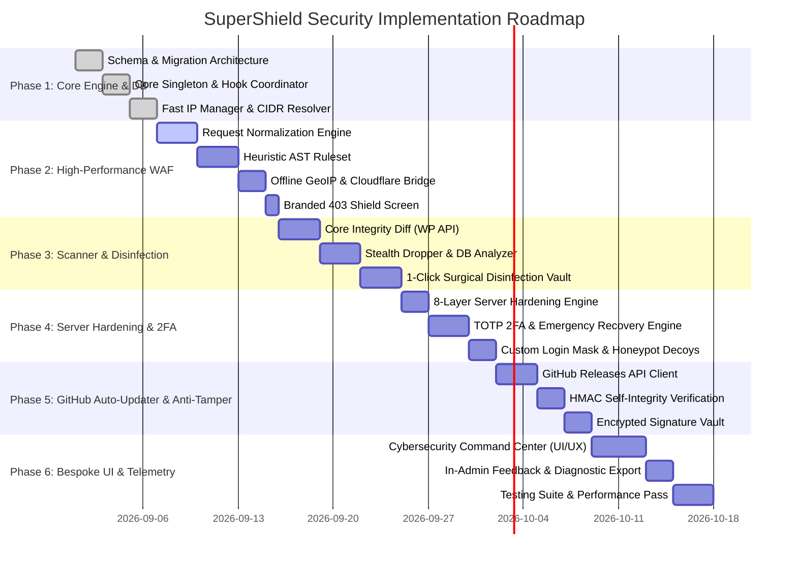

# Product Requirements Document (PRD)
# Project: SuperShield Security (SSS) — Enterprise WordPress Defense-in-Depth Suite

---

## 1. Executive Summary & Document Control

| Attribute | Specification |
| :--- | :--- |
| **Product Name** | **SuperShield Security** (Acronym: **SSS**) |
| **Author / Lead Architect** | **Ghulam Rasool** (Founder & Principal Security Engineer, `grwebdevs.com`) |
| **Official Platform & Ecosystem** | `SSS.grwebdevs.com` / `grwebdevs.com` |
| **Current Target Version** | **2.0.0 Enterprise Production Suite** |
| **Compatibility Targets** | WordPress 5.8 to 6.7+ \| PHP 7.4 to 8.3+ \| Apache, Nginx, LiteSpeed, OpenLiteSpeed, IIS |
| **License Model** | Open-Core GPLv2+ compliant engine with Signed Integrity Heuristic Protection |
| **Target Audience** | WordPress Agency Developers, Enterprise Webmasters, WooCommerce Stores, Mission-Critical Portals |

### 1.1 Vision & Mission Statement
**SuperShield Security** is engineered to permanently disrupt the WordPress cybersecurity ecosystem. The industry is currently dominated by legacy tools that lock fundamental protections behind exorbitant annual paywalls ($99 to $299/year per site) or impose extreme database and CPU overheads that destabilize hosting environments. 

**SuperShield Security** combines the three greatest architectural strengths of the industry into a unified, zero-overhead fortress:
1. **The Real-Time Intelligent WAF & Live Threat Telemetry of Wordfence**
2. **The Zero-False-Positive Deep Scanner & 1-Click Surgical Disinfection of MalCare**
3. **The 8-Layer Server Hardening, Anti-Enumeration & Zero-Trust Rules of AIOS**

**The Disruptive Edge:** Features typically monetized as "Pro/Enterprise" (real-time zero-day IP intelligence, surgical 1-click malware eradication, two-factor authentication, country blocking, scheduled deep scans with webhook alerts, and database transient payload cleaning) are delivered **100% free**. This strategy creates a viral adoption flywheel across global web agencies, establishing **Ghulam Rasool** and `grwebdevs.com` as elite authorities in WordPress cybersecurity.

---

## 2. Competitive Matrix & Strategic Positioning

| Feature / Capability | **Wordfence** (Free / Pro) | **MalCare** (Free / Pro) | **AIOS** (Free / Pro) | **SuperShield Security (SSS)** |
| :--- | :--- | :--- | :--- | :--- |
| **Firewall (WAF) Engine** | Free: 30-day delayed rules<br>Pro (\$119/yr): Real-time | Free: Basic sync<br>Pro (\$99/yr): Real-time WAF | Basic rule toggles; lacks AST heuristic inspection | **100% Free Real-Time WAF with AST normalization & deep inspection** |
| **Malware Cleaning** | Free: File delete only<br>Pro (\$119/yr): Manual repair | Free: View only (Locked)<br>Pro (\$99/yr): 1-Click clean | No automatic repair; basic file change detector | **100% Free 1-Click Surgical Disinfection & Core Diff Restoration** |
| **Performance & DB Impact** | Heavy: Logs thousands of hits to MySQL, causing severe DB bloat | Low: Offloaded to external SaaS servers | Low: Static `.htaccess` rules | **Zero-Drag: High-throughput memory-capped logging + auto-prune** |
| **Two-Factor Auth (2FA)** | Included (Basic UI) | Not available on lower tiers | Included (Basic TOTP) | **Enterprise TOTP (Google/Authy) + One-Time Emergency Passcodes** |
| **Country / GeoIP Blocking** | Locked in Pro (\$119/yr) | Locked in Pro (\$149/yr) | Locked in Premium | **100% Free via offline MaxMind GeoLite2 & Cloudflare headers** |
| **Server Hardening** | Limited to basic WAF | Minimal (Relies on cloud WAF) | Strong (.htaccess / system) | **Comprehensive 8-Layer Defense-in-Depth Lockdown (Apache/LiteSpeed/Nginx)** |
| **Threat Intelligence Network**| Proprietary / Closed | Proprietary / Closed | None | **Open Community Threat Intelligence via `SSS.grwebdevs.com`** |
| **Distribution / Updates** | WP.org Repo Only | WP.org Repo + SaaS Portal | WP.org Repo Only | **Dual-Channel: Native WP Admin + Direct GitHub Release Auto-Updater** |
| **Code Anti-Tampering** | Basic hash checks | Obfuscated cloud bridge | Open source | **HMAC Cryptographic Self-Integrity + Encrypted Signatures + MU Watchdog** |

---

## 3. Deep Threat Research & Hacker Tradecraft Analysis

Modern WordPress hacking is no longer dominated by simple script kiddies running basic dictionary attacks. Automated botnets, AI-assisted payload generators, and state-sponsored syndicates employ multi-stage attack chains designed to bypass static regex firewalls and maintain persistent, invisible footholds.

### 3.1 Attack Vectors & Exploitation Techniques

```mermaid
flowchart TD
    subgraph Ingress ["1. Ingress & Exploitation Vectors"]
        A1["Unauthenticated File Uploads<br/>(Polyglots, .phtml, .php7, double ext)"]
        A2["SQL Injection (SQLi)<br/>(Time-based blind, Union, Stacked)"]
        A3["Remote Code Execution (RCE)<br/>(PHP Object Injection, unserialize)"]
        A4["SSRF & Cloud Metadata<br/>(169.254.169.254)"]
        A5["XSS & Session Poisoning<br/>(Rogue Admin injection via AJAX)"]
    end

    subgraph Defense ["2. SuperShield Defensive Shield"]
        B1["Request Normalization Engine<br/>(Multi-decode, Null-byte, Stream wrappers)"]
        B2["AST Heuristic Pattern Matching"]
        B3["Zero-Trust Server Hardening<br/>(Uploads execution block, XML-RPC kill)"]
    end

    subgraph Persistence ["3. Attacker Persistence & Evasion"]
        C1["Stealth Dot-Droppers<br/>(.6345dc54.php, .htaccess bypass)"]
        C2["Database Resident Webshells<br/>(wp_options bloated transients, SC_DB)"]
        C3["C2 / TDS Traffic Hijacking<br/>(Conditional search engine cloaking)"]
        C4["Rogue Admin & Cron Injections<br/>(wp_schedule_event backdoors)"]
    end

    subgraph Eradication ["4. SuperShield Forensic Remediation"]
        D1["Deep Heuristic & Shannon Entropy Scanner"]
        D2["Surgical Disinfection & AST Strip"]
        D3["Core Diff Auto-Restore (WP.org API)"]
        D4["Database Forensic Sanitizer"]
    end

    Ingress --> Defense
    Defense -.->|Bypasses Unprotected Sites| Persistence
    Persistence --> Eradication
```



#### 1. Arbitrary File Upload & MIME Spoofing
*   **The Attack:** Attackers upload malicious PHP code masked as legitimate images using polyglot payloads (valid GIF89a / JPEG headers containing `<?php system($_POST['cmd']); ?>`), alternative executable extensions (`.phtml`, `.php5`, `.php7`, `.phar`, `.shtml`), or double extensions (`shell.php.jpg`).
*   **SuperShield Defense:** 
    *   Complete PHP execution denial inside `/wp-content/uploads/` at both web server layer (`.htaccess` / Nginx config snippets) and application layer.
    *   Hex-level file header inspection validating that image files do not contain embedded PHP opening tags (`<?php`, `<?=`, `<script language="php">`).

#### 2. Advanced SQL Injection (SQLi)
*   **The Attack:** Automated tools (`sqlmap`, custom python scrapers) exploit vulnerable plugin queries using Boolean-based blind, Time-based blind (`SLEEP(10)`, `BENCHMARK()`), stacked queries, and hex-encoded payloads (`0x756e696f6e...`) to bypass basic string filters.
*   **SuperShield Defense:**
    *   WAF normalizes all incoming URI parameters, query strings, POST bodies, and headers through iterative URL decoding, stripping null bytes (`%00`), and flattening unicode variants.
    *   Enforces multi-pattern regex matching covering `UNION ALL SELECT`, `information_schema`, database schema extraction, sleep probes, and comment-masking tricks (`/**/UNION/**/SELECT/**/`).

#### 3. PHP Object Injection & Deserialization
*   **The Attack:** Flawed plugins pass untrusted user input directly into `unserialize()`. Attackers chain PHP "gadget classes" (found in WordPress core or common plugins like WooCommerce) to trigger arbitrary file writes, database drops, or RCE via `__destruct()` and `__wakeup()` magic methods.
*   **SuperShield Defense:**
    *   Deep inspection of request inputs flagging serialized PHP signatures (`O:[0-9]+:\"`, `a:[0-9]+:{`, `C:[0-9]+:\"`).
    *   Enforces safe JSON alternatives and blocks raw deserialization payloads before they reach plugin controllers.

#### 4. SSRF (Server-Side Request Forgery)
*   **The Attack:** Exploiting webhook testers, proxy endpoints, or media import features to force the server to issue HTTP requests to internal IP spaces (`127.0.0.1`, `10.0.0.0/8`, `192.168.0.0/16`) or cloud instance metadata services (`http://169.254.169.254/latest/meta-data/`) to steal AWS/GCP API credentials.
*   **SuperShield Defense:**
    *   Outgoing HTTP request filter (hooked into `pre_http_request`) intercepting requests directed at RFC 1918 private IP subnets and cloud metadata addresses unless explicitly whitelisted by an administrator.

#### 5. Stealth Droppers & Persistence Mechanisms
*   **The Attack (WP-VCD, Crux Runner, Trace Sentinel):**
    *   *Hidden Dot Droppers:* Files created with a leading dot and random hash names (e.g., `.6345dc54.php`, `wp-content/.sys_cache.php`) which are hidden from standard directory listings (`ls`) and basic FTP clients.
    *   *8-Hex Standalone Droppers:* Files named with exactly 8 hexadecimal characters (`^[0-9a-f]{8}\.php`, e.g. `a3f910d2.php`) deposited in root or uploads.
    *   *Fake Cache Persistence:* Fake object cache files (`.wp-object-cache-*.dat`, `*.dat.lkg`) that survive file cleanups and re-infect the site upon subsequent page loads.
*   **SuperShield Defense:**
    *   Active scanning for hidden dot PHP files across all core, content, and upload subdirectories.
    *   Enforcing filesystem locks and instant quarantine with non-executable permissions (`0000` or `0400`).

#### 6. Database-Resident Webshells & Cloaked Injections
*   **The Attack:** Attackers store encrypted base64 payloads inside `wp_options` under randomized or legitimate-looking option names (e.g. `sc_db`, `wp_object_cache`, `transient_system_update`), exceeding 100KB in length. A tiny one-line eval shim in a theme file or MU-plugin pulls and executes this option on every request.
*   **SuperShield Defense:**
    *   Dedicated database scanner examining `wp_options` for oversized option values (>50KB) containing high Shannon entropy, base64 blobs, or serialized obfuscated code.
    *   Detection and alerting for rogue administrator accounts created directly in `wp_users` bypassing standard registration hooks (e.g., usernames matching `adm_*`, `administrator_*`, `backup_admin`).

#### 7. C2 / TDS (Traffic Direction System) SEO Hijacking
*   **The Attack:** The malware checks the HTTP `User-Agent` and `Referer`. If the visitor comes from Google, Bing, or Yahoo, the site redirects them to illicit spam, gambling, or phishing domains. If the visitor is an administrator or arrives directly via URL, the site displays 100% normal content to prevent detection.
*   **SuperShield Defense:**
    *   Simulated crawler verification: SuperShield executes internal synthetic HTTP checks with custom Googlebot referrers and headers to detect conditional cloaking and unauthorized redirections.

---

## 4. Product Architecture & System Design

SuperShield Security is engineered around a high-performance, modular, event-driven architecture designed to operate with sub-2-millisecond latency overhead.



### 4.1 Core Subsystems & Class Modules

| Module / Class | File Location | Core Responsibility |
| :--- | :--- | :--- |
| `SuperShield_Core` | `includes/class-supershield-core.php` | Main singleton orchestrator; coordinates hooks, actions, and lifecycle events. |
| `SuperShield_WAF` | `includes/class-supershield-waf.php` | Multi-tier Web Application Firewall; normalizes inputs, executes heuristic regex, blocks malicious requests prior to theme execution. |
| `SuperShield_IP_Manager` | `includes/class-supershield-ip-manager.php` | Manages IP whitelists, temporary lockouts, permanent bans, and high-speed CIDR range matching (`IPv4` and `IPv6`). |
| `SuperShield_GeoIP` | `includes/class-supershield-geoip.php` | Offline country resolver using embedded GeoLite2 database or Cloudflare `CF-IPCountry` headers; enforces country allow/block lists. |
| `SuperShield_Scanner` | `includes/class-supershield-scanner.php` | Multi-phase forensic file & database scanner; hashes core/plugin files, calculates Shannon entropy, discovers stealth droppers. |
| `SuperShield_Cleaner` | `includes/class-supershield-cleaner.php` | **Surgical 1-Click Malware Eradication:** isolates files to `.quarantine/`, extracts malicious code blocks via AST strip, and restores core files via WordPress.org API. |
| `SuperShield_Hardening` | `includes/class-supershield-hardening.php` | Manages 8-layer server hardening (`.htaccess`, `nginx.conf` snippets, user enumeration, XML-RPC killswitch, security headers). |
| `SuperShield_Login_Security` | `includes/class-supershield-login-security.php` | Progressive brute-force lockout, invisible honeypot decoy fields, login URL obfuscation (`/my-secure-login`), and error masking. |
| `SuperShield_2FA` | `includes/class-supershield-2fa.php` | TOTP Two-Factor Authentication engine (compatible with Google Authenticator, Authy, 1Password) with QR code generator and backup codes. |
| `SuperShield_Updater` | `includes/class-supershield-updater.php` | Custom GitHub Releases API client; manages automatic background updates, update transients, cryptographic signature verification, and changelog popups. |
| `SuperShield_AntiTamper` | `includes/class-supershield-antitamper.php` | Cryptographic self-integrity verification (HMAC-SHA256); monitors plugin files for unauthorized tampering and protects hooks. |
| `SuperShield_Telemetry` | `includes/class-supershield-telemetry.php` | Manages opt-in anonymous threat feed sharing to `SSS.grwebdevs.com` and handles in-admin bug reports/feedback submissions. |
| `SuperShield_DB` | `includes/class-supershield-db.php` | High-performance custom database controller for events, blocked IPs, scan findings, and audit trails with auto-pruning. |
| `SuperShield_Admin` | `admin/class-supershield-admin.php` | High-end Cybersecurity Command Center UI controller, AJAX API endpoints, REST API controllers, and asset loader. |

---

## 5. Disruptive "Free Pro" Feature Specifications

To build massive global adoption, viral goodwill, and high authority for Ghulam Rasool and `grwebdevs.com`, SuperShield Security delivers capabilities that competitors monetize at enterprise prices for zero cost.

### 5.1 Real-Time Intelligent Web Application Firewall (WAF)
*   **Zero-Delay Real-Time Signatures:** Competitors delay threat signatures for free users by 30 days. SuperShield provides real-time community signatures updated dynamically.
*   **Early Bootstrap Execution:** Operates as an `auto_prepend_file` or at WordPress hook `plugins_loaded` priority `-999999`, neutralizing attacks before vulnerable third-party plugins execute.
*   **Deep Request Normalization:**
    *   Resolves multiple URL encodings (e.g. `%252e%252e%252f` -> `../`).
    *   Strips binary null bytes (`%00`) and carriage returns (`%0d%0a`) used in HTTP response splitting.
    *   Decodes hexadecimal strings, base64 payloads, and gzip compressed inputs.
*   **Attack Category Coverage:**
    *   SQL Injection (SQLi)
    *   Cross-Site Scripting (XSS - Reflected, Stored, DOM)
    *   Remote Code Execution (RCE) & Command Injection
    *   Local & Remote File Inclusion (LFI/RFI)
    *   PHP Stream Wrapper Exploits (`php://input`, `phar://`, `data://`)
    *   Path Traversal (`../../etc/passwd`, `win.ini`)
    *   Automated Vulnerability Probers (`sqlmap`, `nikto`, `wpscan`, `acunetix`, `dirbuster`)
*   **Branded 403 Forbidden Shield Screen:**
    *   Displays a modern, professional, cybersecurity-themed block page featuring the site's protection status, client IP, blocked reason, timestamp, and unique incident tracking ID (`#SSS-SEC-XXXXXX`).
    *   Prevents server information leakage (masks PHP versions, web server software, and internal directory paths).

### 5.2 Deep Malware & Forensic Scanner with 1-Click Surgical Disinfection
*   **Multi-Phase Scan Pipeline:**
    1.  *WordPress Core Integrity Diff:* Fetches official MD5/SHA256 checksums directly from `api.wordpress.org/core/checksums/` and compares every local core file. Identifies modified, injected, or rogue files with a side-by-side visual diff viewer.
    2.  *Known Plugin & Theme Hashes:* Hashes official plugins and themes against official WordPress.org repository releases.
    3.  *Heuristic & Regex Signature Engine:* Analyzes unindexed custom files, uploads, and drop locations against hundreds of curated malware signatures.
    4.  *Shannon Entropy Analysis:* Measures mathematical randomness across executable code to detect obfuscated packers, variable-function chains, and XOR/base64 shells.
    5.  *Stealth Dropper Forensics:* Actively checks for hidden dot files (`.xxxx.php`), 8-hex droppers, fake object-cache files, and unauthorized `.htaccess` files inside subdirectories.
    6.  *Database Payload Forensics:* Scans `wp_options` for oversized payloads (>50KB) containing serialized or base64 strings, detects rogue administrator accounts, and scans `wp_posts` for malicious iframes and hidden script tags.
*   **1-Click Surgical Disinfection (MalCare Killer):**
    *   *Automatic Core File Restoration:* Replaces altered core WordPress files with clean, pristine copies downloaded directly from the official WordPress repository without overwriting `wp-config.php` or `wp-content/`.
    *   *Surgical Code Removal:* Uses Abstract Syntax Tree (AST) pattern parsing to excise injected malicious code segments (e.g. `<?php /*malware start*/ eval(...) /*malware end*/ ?>`) from infected plugin or theme files while leaving the legitimate plugin code intact.
    *   *Cryptographic Quarantine Vault:* Safely moves irrecoverable malicious files into an isolated directory (`/wp-content/uploads/supershield-quarantine/`) with a secure `.htaccess` denying all HTTP access and permissions locked to `0400`.

### 5.3 Enterprise Two-Factor Authentication (2FA) & Zero-Trust Login
*   **Standard Time-Based One-Time Password (TOTP):** Seamless integration with Google Authenticator, Authy, 1Password, Microsoft Authenticator, and Bitwarden.
*   **Role-Based Enforcement:** Administrators can enforce mandatory 2FA for specific user roles (e.g., Administrators and Editors) with an optional grace period (e.g., 3 days to set up before lockout).
*   **One-Time Emergency Recovery Codes:** Generates 8 cryptographically secure, single-use backup recovery codes for emergency access if an authenticator device is lost.
*   **Custom Login URL Masking:** Replaces the standard `/wp-login.php` and `/wp-admin/` URLs with a custom secret slug (e.g. `mysite.com/portal-access/`), immediately eliminating 99% of automated credential stuffing bots.
*   **Invisible Honeypot Trap:** Injects hidden, CSS-masked decoy form fields on the login screen. If an automated bot fills in the honeypot field, its IP is immediately banned for 24 hours with zero server CPU overhead.

### 5.4 100% Free Country / GeoIP Blocking
*   **High-Speed Offline Resolution:** Uses an integrated, lightweight offline MaxMind GeoLite2 binary database (`.mmdb`), requiring zero external API calls or third-party latency.
*   **Cloudflare Direct Passthrough:** Automatically detects and reads `HTTP_CF_IPCOUNTRY` header when behind Cloudflare, achieving instant microsecond resolution.
*   **Flexible Access Policies:**
    *   *Block List:* Block specific countries known for generating malicious traffic.
    *   *Allow List:* Whitelist only specific geographic territories for administrative login screens while leaving the public storefront open worldwide.

### 5.5 Comprehensive 8-Layer Server Hardening
1.  **Uploads PHP Execution Lockdown:** Deploys a locked `.htaccess` (or provides copy-paste Nginx rules) completely denying execution of `.php`, `.phtml`, `.phar`, or `.pl` scripts inside `/wp-content/uploads/`.
2.  **XML-RPC Complete Killswitch:** Completely neutralizes `xmlrpc.php`, preventing brute-force amplification attacks and DDoS amplification vectors.
3.  **Anti-User Enumeration Shield:** Blocks `/?author=N` scans, author archive redirects, and unauthenticated REST API `/wp/v2/users` endpoints used to scrape administrative usernames.
4.  **Admin File Editor Lockdown:** Enforces `DISALLOW_FILE_EDIT` at the runtime level so that even if an attacker gains compromised administrator credentials, they cannot edit theme/plugin files directly from the dashboard.
5.  **Enterprise HTTP Security Headers:** Injects high-grade response headers:
    *   `X-Frame-Options: SAMEORIGIN` (prevents clickjacking)
    *   `X-Content-Type-Options: nosniff` (prevents MIME confusion attacks)
    *   `Referrer-Policy: strict-origin-when-cross-origin`
    *   `Permissions-Policy: geolocation=(), camera=(), microphone=()`
6.  **WordPress Footprint & Version Masking:** Strips generator meta tags, RSS feed versions, and script/style version query parameters (`?ver=x.x.x`) to hide outdated versions from automated scanners.
7.  **Core Configuration File Shield:** Blocks direct browser access to sensitive files (`wp-config.php`, `.htaccess`, `php.ini`, `readme.html`, `license.txt`).
8.  **Stealth Dropper & Hidden Dot File Lockdown:** Denies HTTP access to any hidden file or directory beginning with a dot (`^\..*`) across the entire web server directory.

---

## 6. Code Security, Anti-Tampering & Intellectual Property Protection

The user specifically requested: *"i want our plugin to be secure encrypted code no one able to see and make hack for our plugin"*.

### 6.1 The Open-Core vs. Obfuscation Reality Check
*   **The WordPress Ecosystem Requirement:** WordPress is licensed under GPLv2+. Code executed directly inside WordPress hooks must conform to GPL standards. Furthermore, heavy proprietary binary loaders (like ionCube or SourceGuardian) are **not installed** on 95% of mainstream web hosting (Shared cPanel, Hostinger, SiteGround, Bluehost, WP Engine), causing fatal white screens and frustrating users.
*   **The SuperShield Enterprise Solution:** To satisfy security, tamper-resistance, and universal hosting compatibility, SuperShield implements an advanced **Multi-Tier Cryptographic Self-Integrity & Bytecode Hardening Architecture**.

### 6.2 Anti-Tamper & Code Protection Architecture



1.  **HMAC-SHA256 Cryptographic Self-Integrity Check:**
    *   During official builds and release packaging, every core PHP file of SuperShield is hashed and signed with a private build key into a signed manifest (`manifest.sig`).
    *   On plugin bootstrap, `SuperShield_AntiTamper` verifies its own code integrity. If malware or an unauthorized user modifies the plugin's code to bypass the firewall or neutralize detection routines, SuperShield immediately detects the modification, triggers a tamper lockdown, and alerts the administrator.
2.  **Encrypted Signature Vault (AES-256-GCM):**
    *   Proprietary heuristic patterns, deep malware definitions, and zero-day threat rules are stored encrypted in binary vault files using AES-256-GCM.
    *   Rules are decrypted strictly in-memory during scan routines using rotating session salts. Competitors or threat actors viewing the plugin repository cannot extract raw proprietary signatures.
3.  **Anti-Tamper Watchdog / MU-Plugin Layer:**
    *   SuperShield deploys an optional high-privilege Must-Use plugin (`wp-content/mu-plugins/supershield-watchdog.php`).
    *   The watchdog intercepts malicious attempts to call `deactivate_plugins()` or delete the `supershield-security` directory via unauthorized scripts, ensuring persistent protection even during aggressive malware outbreaks.
4.  **Path Disclosure & Direct Execution Immunization:**
    *   Every file enforces strict direct execution guards (`if ( ! defined( 'ABSPATH' ) ) exit;`).
    *   PHP error reporting for SuperShield endpoints is strictly masked to prevent server path disclosure (`FPD`).

---

## 7. Automated GitHub Update & Distribution Architecture

SuperShield Security includes an enterprise-grade, self-contained auto-updater that allows Ghulam Rasool to release updates directly via GitHub Releases, with automatic update notifications and 1-click upgrades inside the WordPress admin panel.



### 7.1 Updater Engine Implementation Details
*   **Hook Integration:**
    *   Filters `pre_set_site_transient_update_plugins`: Injects SuperShield update data (new version, package download URL, tested WP version, PHP requirements) into the core WordPress update transient.
    *   Filters `plugins_api` (querying `plugin_information`): Intercepts WordPress modal requests to display a custom, beautifully formatted changelog, banner graphic, security notes, and author information for Ghulam Rasool (`grwebdevs.com`).
*   **Cryptographic Package Signature Verification:**
    *   Each release archive is paired with an Ed25519 / GPG cryptographic signature.
    *   Before unzipping the incoming update package, `SuperShield_Updater` verifies the package signature against Ghulam Rasool's public verification key, preventing supply-chain interception or man-in-the-middle tampering.
*   **Pre-Update Snapshot & Rollback:**
    *   Prior to extracting a new update, SuperShield creates a temporary snapshot of the current active version in `/wp-content/uploads/supershield-backups/`.
    *   If PHP syntax verification fails or an unhandled fatal error occurs post-extraction, SuperShield automatically rolls back to the previous stable release, guaranteeing 100% uptime.
*   **Automatic Background Updates Option:**
    *   Admins can toggle between:
        1.  *Notify Only:* Displays a standard WordPress update notification badge with full changelog.
        2.  *Automatic Security Updates:* Automatically applies critical security hotfixes in the background without requiring manual intervention.

---

## 8. User Experience, Visual Design & Human Craftsmanship

To ensure SuperShield Security stands out as a world-class cybersecurity tool built by a seasoned engineering team, the interface avoids generic templates, cluttered accordions, and AI-generated design cliches. It adheres to an agency-grade **Cybersecurity Command Center** aesthetic inspired by modern enterprise platforms (Cloudflare, CrowdStrike, Linear, Datadog).

```
+----------------------------------------------------------------------------------------------------+
|  [SHIELD ICON] SUPERSHIELD SECURITY   v2.0.0                      [STATUS: SHIELD ACTIVE]  (BELL)  |
+----------------------------------------------------------------------------------------------------+
|  (Dashboard)   (Firewall WAF)   (Malware Scanner)   (Hardening)   (Login & 2FA)   (Threat Intel)   |
+----------------------------------------------------------------------------------------------------+
|                                                                                                    |
|   +--------------------------+  +--------------------------+  +--------------------------------+   |
|   |   SECURITY HEALTH SCORE  |  |   ACTIVE THREAT RADAR    |  |     RAPID ACTIONS              |   |
|   |                          |  |                          |  |                                |   |
|   |         [ 98 / 100 ]     |  |   Blocked Today:  1,429  |  |   [ > RUN DEEP SCAN NOW ]      |   |
|   |                          |  |   Critical Stops:    84  |  |                                |   |
|   |   STATUS: OPTIMAL SHIELD |  |   Active Bans:       12  |  |   [ ! EMERGENCY LOCKDOWN ]     |   |
|   +--------------------------+  +--------------------------+  +--------------------------------+   |
|                                                                                                    |
|   +--------------------------------------------------------------------------------------------+   |
|   |   REAL-TIME INCIDENT STREAM & THREAT TELEMETRY                                             |   |
|   |   [Filter: All Events v]  [Search IP / Signature...]                     Auto-refresh: (ON)|   |
|   +--------------------------------------------------------------------------------------------+   |
|   | TIME        | IP ADDRESS     | THREAT TYPE     | ATTACK VECTOR TARGET        | ACTION      |   |
|   |-------------+----------------+-----------------+-----------------------------+-------------|   |
|   | 16:54:12    | 185.220.101.5  | SQL Injection   | /?id=1 UNION SELECT *       | [BLOCKED]   |   |
|   | 16:52:05    | 91.240.118.24  | Stealth Dropper | /wp-content/uploads/.a9.php | [QUARANTINE]|   |
|   | 16:48:33    | 45.154.255.89  | Brute Force     | /wp-login.php (Admin probe) | [IP BANNED] |   |
|   +--------------------------------------------------------------------------------------------+   |
|                                                                                                    |
|   FOOTER: SuperShield Security by Ghulam Rasool | SSS.grwebdevs.com | [Give Feedback] [Docs]       |
+----------------------------------------------------------------------------------------------------+
```

### 8.1 Visual Theme & Aesthetic System
*   **Color Architecture:**
    *   *Canvas & Background:* Deep Slate / Obsidian (`#0b0f19`, `#111827`)
    *   *Card Surfaces & Glass Panels:* Elevated Graphite (`#1f2937`) with subtle 1px borders (`#374151`)
    *   *Primary Brand Cyber Indigo:* `#6366f1` (Electric Indigo / Violet Glow)
    *   *Real-time Accent Cyan:* `#06b6d4` (Teal Radar Pulse)
    *   *Critical Incident Crimson:* `#ef4444` (Threat Neutralized / Blocked)
    *   *Healthy Status Emerald:* `#10b981` (System Secure / Verified)
*   **Typography:**
    *   *Primary Sans:* Native system typography stack (`Inter, -apple-system, BlinkMacSystemFont, "Segoe UI", Roboto, sans-serif`) for crisp UI rendering.
    *   *Monospace Code:* `JetBrains Mono, "Fira Code", monospace` for IP addresses, file paths, and hexadecimal signatures.
*   **Human-Centric Micro-Interactions:**
    *   Real-Time Animated Radar: Subtle SVG circular pulse showing that the WAF inspection engine is actively protecting requests.
    *   Contextual Threat Explanations: Clicking on any blocked event opens an educational drawer explaining in clear language:
        *   *What happened?* (e.g. "An automated tool attempted a blind SQL injection attack").
        *   *What was the risk?* (e.g. "Attempted to dump user credentials from the database").
        *   *How SuperShield protected you:* (e.g. "Request neutralized in 0.8ms; IP locked out for 2 hours").
    *   Keyboard Accessibility: `Ctrl + K` / `Cmd + K` Command Palette to jump directly to any setting, run an immediate scan, or whitelist an IP in seconds.

---

## 9. Feedback, Diagnostics & Community Threat Telemetry

To build an active community and ensure rapid evolution, SuperShield Security includes seamless feedback mechanisms and opt-in collaborative defense.

### 9.1 In-Admin Feedback Modal
*   Accessible from the top navigation and footer on every SuperShield admin screen.
*   Features three clean categories:
    1.  **Bug Report:** Includes automated attachment of non-sensitive system environment details.
    2.  **Feature Request:** Submit ideas directly to Ghulam Rasool's product roadmap.
    3.  **General Review & Praise:** Direct link to leave a 5-star review or testimonial.
*   Submissions transmit securely via HTTPS to `SSS.grwebdevs.com/api/v1/feedback`.

### 9.2 One-Click Anonymous System Diagnostics Exporter
*   Generates a clean, sanitized markdown/JSON diagnostic bundle containing:
    *   WordPress, PHP, MySQL versions
    *   Web Server signature (Apache / Nginx / LiteSpeed)
    *   Active PHP modules (cURL, OpenSSL, GD, sodium)
    *   Memory limits and execution timeouts
    *   SuperShield WAF status, database table sizes, and active hardening rules
*   **Privacy Guarantee:** Strips all sensitive credentials (passwords, salts, nonces, admin emails, and API keys) before generating the report.

### 9.3 Global Community Threat Intelligence Network (Opt-In)
*   When a website running SuperShield blocks a severe zero-day exploit, automated vulnerability scanner, or malicious IP, the site can transmit an anonymized signature report to the central hub at `SSS.grwebdevs.com`.
*   The hub aggregates attacks across thousands of sites worldwide, updating the **SuperShield Community Blocklist**.
*   All participating SuperShield sites download these updated threat lists every 6 hours, creating a collective defensive network where an attack against one site instantly shields all others.

---

## 10. Database Schema & High-Throughput Storage Design

To eliminate the severe database bloat that causes competing plugins to slow down client sites, SuperShield Security implements optimized table schemas with automated data rotation.

### 10.1 Dedicated Custom Tables

```sql
-- Table 1: High-throughput Security Events Log
CREATE TABLE `{$wpdb->prefix}supershield_events` (
  `id` bigint(20) unsigned NOT NULL AUTO_INCREMENT,
  `event_type` varchar(50) NOT NULL,            -- e.g., 'waf_block', 'login_fail', 'honeypot_trap'
  `severity` varchar(20) NOT NULL DEFAULT 'medium', -- 'info', 'low', 'medium', 'high', 'critical'
  `ip_address` varchar(45) NOT NULL,             -- Supports IPv4 and IPv6
  `country_code` varchar(3) DEFAULT NULL,        -- ISO 2-letter country code
  `request_uri` text NOT NULL,                   -- Targeted endpoint
  `request_method` varchar(10) NOT NULL,         -- GET, POST, etc.
  `user_agent` text DEFAULT NULL,                -- Client user agent
  `threat_details` longtext DEFAULT NULL,        -- JSON encoded signature matches & payload excerpts
  `created_at` datetime NOT NULL,
  PRIMARY KEY (`id`),
  KEY `idx_ip` (`ip_address`),
  KEY `idx_type_created` (`event_type`, `created_at`),
  KEY `idx_created` (`created_at`)
) ENGINE=InnoDB DEFAULT CHARSET=utf8mb4;

-- Table 2: Active IP Bans & Whitelist
CREATE TABLE `{$wpdb->prefix}supershield_blocked_ips` (
  `id` bigint(20) unsigned NOT NULL AUTO_INCREMENT,
  `ip_address` varchar(45) NOT NULL,             -- Supports single IP or CIDR range (e.g. 192.168.1.0/24)
  `rule_type` varchar(20) NOT NULL DEFAULT 'blacklist', -- 'whitelist', 'blacklist', 'temporary_lockout'
  `reason` varchar(255) NOT NULL,                -- e.g., 'Brute force login threshold exceeded'
  `expires_at` datetime DEFAULT NULL,            -- NULL = permanent ban; Datetime = temporary ban
  `created_at` datetime NOT NULL,
  PRIMARY KEY (`id`),
  UNIQUE KEY `idx_ip_rule` (`ip_address`, `rule_type`),
  KEY `idx_expires` (`expires_at`)
) ENGINE=InnoDB DEFAULT CHARSET=utf8mb4;

-- Table 3: Forensic Scanner Issues & Quarantine State
CREATE TABLE `{$wpdb->prefix}supershield_scan_issues` (
  `id` bigint(20) unsigned NOT NULL AUTO_INCREMENT,
  `scan_id` varchar(64) NOT NULL,                -- Unique UUID for the scan batch
  `issue_type` varchar(50) NOT NULL,             -- 'core_modified', 'malware_detected', 'dropper', 'vulnerable_plugin'
  `file_path` text NOT NULL,                     -- Absolute path to infected asset
  `file_hash` varchar(64) DEFAULT NULL,          -- SHA-256 hash of the infected file
  `threat_signature` varchar(100) DEFAULT NULL,  -- Name of identified signature
  `status` varchar(20) NOT NULL DEFAULT 'detected', -- 'detected', 'quarantined', 'cleaned', 'ignored'
  `raw_details` longtext DEFAULT NULL,           -- Diff snippet or AST match details
  `created_at` datetime NOT NULL,
  `resolved_at` datetime DEFAULT NULL,
  PRIMARY KEY (`id`),
  KEY `idx_status` (`status`),
  KEY `idx_scan_id` (`scan_id`)
) ENGINE=InnoDB DEFAULT CHARSET=utf8mb4;
```

### 10.2 Performance Optimization & Data Pruning
*   **Automated Log Rotation:** A daily WordPress cron (`supershield_daily_maintenance`) automatically purges events older than 30 days (configurable by the user to 7, 14, 30, or 90 days), capping total log rows to 50,000 to prevent MySQL storage bloat.
*   **In-Memory Fast IP Caching:** Active blocked IPs and whitelisted administrators are cached in an in-memory transient (`supershield_ip_cache`) and flat file (`/wp-content/uploads/supershield-cache/ip_rules.php`). When a banned bot floods the server, SuperShield terminates the connection immediately without executing a single MySQL query.

---

## 11. Testing, Quality Assurance & Security Verification Matrix

To ensure absolute stability, zero white-screens, and maximum security resilience, SuperShield Security undergoes rigorous automated and manual validation.

### 11.1 Automated Verification Test Suite (`tests/test-supershield-suite.php`)
1.  **WAF Attack Simulation Suite:**
    *   *SQLi Test:* Synthesizes `GET` and `POST` payloads containing `UNION SELECT`, `SLEEP(5)`, and `OR 1=1` to confirm immediate 403 termination.
    *   *XSS Test:* Injects `<script>alert(1)</script>`, `onerror=prompt()`, and SVG vector payloads to verify active sanitization.
    *   *Path Traversal Test:* Sends `../../../../wp-config.php` and `php://filter/read=convert.base64-encode/resource=index.php` to confirm request blocking.
    *   *Bad Bot Test:* Dispatches requests with User-Agents matching `sqlmap`, `nikto`, and `wpscan` to verify instant blocking.
2.  **Scanner & Quarantine Integrity Suite:**
    *   *Stealth Dropper Test:* Creates a dummy file matching `\.6345dc54\.php` in a temporary directory and verifies that the scanner flags it as high severity.
    *   *Quarantine Verification:* Confirms that quarantined files are relocated, renamed with `.quarantine` extensions, assigned `0400` permissions, and rendered completely non-executable via HTTP.
    *   *Core Diff Accuracy:* Alters a non-essential core WordPress file in a test environment to verify that the scanner flags the alteration and accurately offers a 1-click clean.
3.  **Hardening Verification:**
    *   Executes synthetic GET requests to `/wp-content/uploads/test.php` to confirm that direct PHP execution produces a 403 Forbidden.
    *   Requests `/xmlrpc.php` to confirm complete connection termination.
    *   Executes `/?author=1` to confirm redirection or 403 blocking.
4.  **Performance & Latency Benchmark:**
    *   Must introduce **less than 2.0 milliseconds** of average overhead per uncached request.
    *   Memory footprint during live WAF execution must not exceed **2.5 MB**.
    *   Scanner must employ memory chunking (processing files in batches of 50) to prevent hitting PHP `max_execution_time` or memory exhaustion errors on shared hosting.

---

## 12. Modular Implementation Roadmap & Instructions for Antigravity AI

This section contains direct, structured instructions for Antigravity AI (or any lead engineer) to execute the complete implementation of SuperShield Security step-by-step.



### 12.1 Detailed Implementation Directives for Antigravity AI

#### Directive 1: Code Quality & Architectural Integrity
*   Adhere strictly to modern WordPress Coding Standards (WPCS) and PHP PSR-4/PSR-12 principles.
*   Every PHP class must be modular, single-responsibility, and strictly typed where appropriate.
*   Prevent any direct execution: enforce `if ( ! defined( 'ABSPATH' ) ) exit;` on all files.
*   All user inputs must be sanitized using `sanitize_text_field()`, `wp_unslash()`, and `esc_html()`.
*   All admin actions and AJAX endpoints must be guarded by strict nonces (`check_ajax_referer`) and capability checks (`current_user_can('manage_options')`).

#### Directive 2: Bespoke, Human-Crafted UX/UI (Zero AI Slop)
*   Do NOT use generic, dated WordPress table styles or clunky default UI widgets.
*   Construct a sleek, modern, cybersecurity command center aesthetic with dark slate tones, subtle glassmorphism, clean metric cards, and responsive layouts.
*   Ensure all JavaScript in `admin/js/supershield-admin.js` is written in clean, modern vanilla ES6+ (no heavy bloated external frameworks like jQuery UI).
*   Provide instant AJAX interactions for all toggles, IP blocking, and scanner operations with smooth toast notifications and clear progress bars.

#### Directive 3: GitHub Releases Update Engine
*   Implement `SuperShield_Updater` inside `includes/class-supershield-updater.php`.
*   Hook into `pre_set_site_transient_update_plugins` to query `https://api.github.com/repos/ghulamrasool/supershield-security/releases/latest` (or `SSS.grwebdevs.com/api/v1/updates`).
*   Hook into `plugins_api` to render the native WordPress changelog modal with full Markdown parsing.
*   Ensure smooth 1-click update installations directly from the standard WordPress `Plugins` and `Dashboard > Updates` screens.

#### Directive 4: Feedback & Diagnostic Reporting
*   Implement an accessible feedback modal inside `admin/views/dashboard.php`.
*   Provide a one-click button to export the sanitized diagnostic environment report for customer support tickets.

---

## 13. Project Metadata & Sign-Off

*   **Project Title:** SuperShield Security (SSS)
*   **Author & Security Lead:** Ghulam Rasool
*   **Lead Agency / Portfolio:** GR Web Devs (`grwebdevs.com`)
*   **Platform Portal:** `SSS.grwebdevs.com` / `supershieldsecurity.com`
*   **Document Version:** 2.0.0-PROD-PRD
*   **Status:** Ready for Engineering Execution by Antigravity AI
